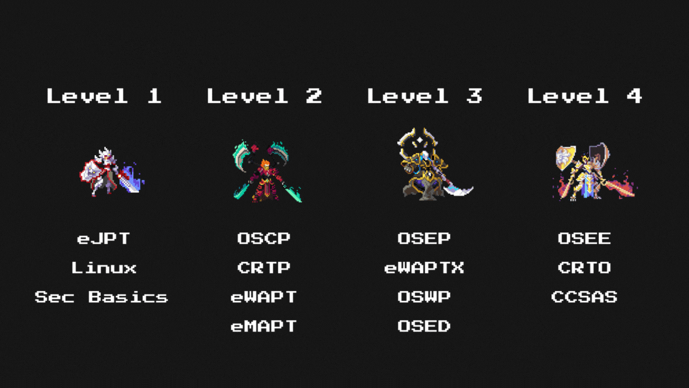

<h1 align="center">Hi 👋, I'm Ammar (xLe0x)</h1>
<h3 align="center">CS Student | Junior Pentester | Python Lover</h3>

  
  
  
  

______________________________________________________________________

## 🚀 My Learning Path

  

- **Current Level:** Level 3\
  (Ongoing: OSEP, eWPTX, OSWP, OSED)

- **Future Goals:** Master **Mobile Pentesting** and add certifications like eMAPT.

______________________________________________________________________

## 📅 Hobbies

- 🔴 Watching **CTF hacking lives**
- 🎮 Playing **CTFs**
- 🛠️ Building **scripts and tools**

______________________________________________________________________

## 📚 Currently Learning

- 💻 **Pentesting** fundamentals and advanced techniques
- 🖥️ **Active Directory** exploitation
- 🔑 **Privilege Escalation** for Linux & Windows
- 🌐 **Web Hacking**

______________________________________________________________________

## 📈 My Goals

- 🌟 Master both **network** and **web pentesting**
- 📱 Learn **Mobile Pentesting**
- 🚀 Contribute to the **security community** through blogs and tools
- 🧠 Stay curious and keep growing every day!

______________________________________________________________________

### 🤝 Let's Connect

Feel free to check out my [website](https://xle0x.netlify.app/) or reach out on [LinkedIn](https://linkedin.com/in/ammarxle0x) to collaborate!
